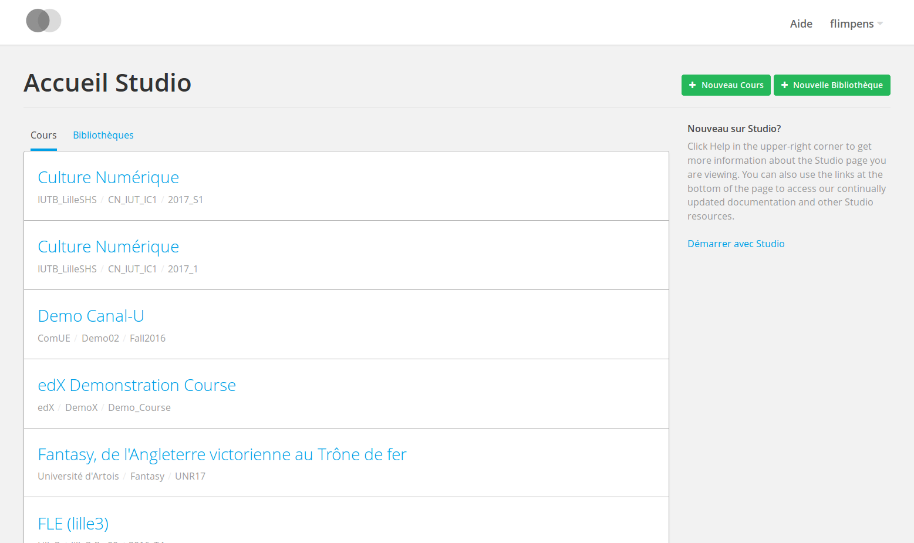
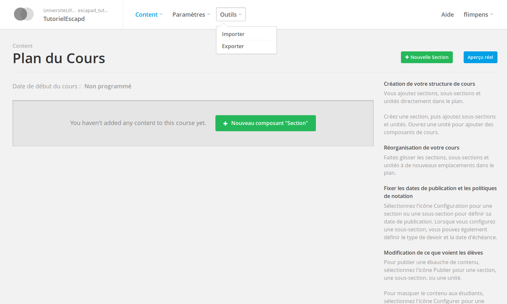
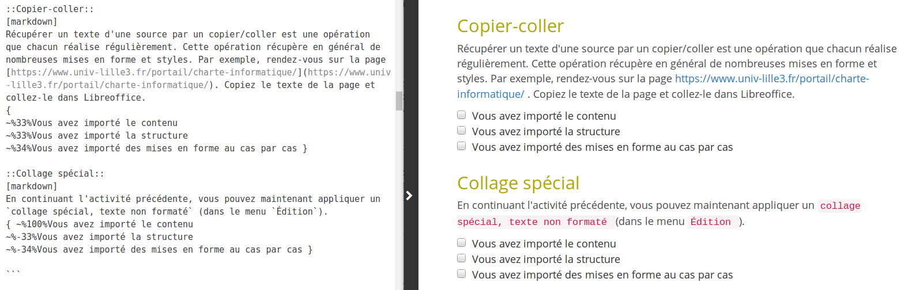
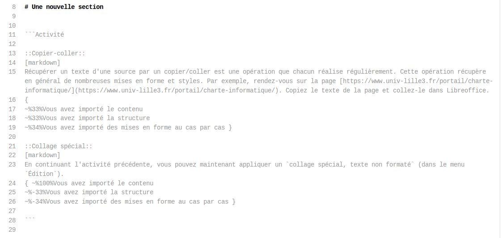
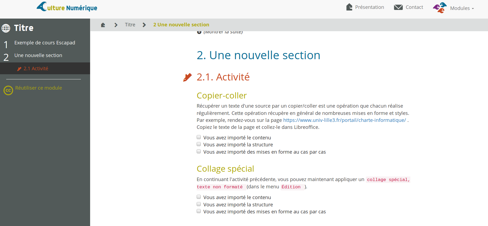

## Tutoriel de prise en main de la chaine éditoriale Esc@pad

Ce chapitre propose un parcours type permettant de prendre en main les outils et technologies qui composent la chaine éditoriale Esc@Pad. L'objectif à l'issue de ce tutoriel est d'être capable d'éditer un contenu pédagogique en autonomie en utilisant Esc@pad. Les outils et notions abordées sont:
- les rudiments de `git` et de la plateforme GitHub (création d'un compte, fork, commits)
- la syntaxe markdown pour la rédaction du contenu
- la syntaxe GIFT pour la création de quiz
- l'usage de l'application Escapad pour la génération des supports multi-format (web, IMS/Moodle, EDX)


## Création d'un compte GitHub et fork

### Création du compte

- remplissez et validez le formulaire localisé à [https://github.com/join](https://github.com/join)
- à l'étape suivante "Choose your plan", laissez l'option "Unlimited public repositories for free", cliquez sur "Continue"
- l'étape suivante "Tailor your experience" peut être sautée ("Skip this step")
- à l'écran final "Learn Git and GitHub without any code!" qui vous invite à lire le guide (hautement conseillé pour la suite néanmoins), ne faites rien, et passez à la suite de ce tutoriel.

### "Fork" du dépôt-exemple

- loguez-vous sur github.com avec votre nouveau `monlogingithub` (login d'exemple utilisé pour la suite, NDR.) et allez sur [https://github.com/CultureNumerique/tutoriel](https://github.com/CultureNumerique/tutoriel)
- cliquez sur le bouton "Fork" en haut à droite
- vous arrivez normalement sur la page du dépôt "forké" `https://github.com/monlogingithub/tutoriel`


Notez à ce stade l'arborescence type d'un dépôt de cours qui contient 1 module "module1" (explorez les dossiers en cliquant sur leur nom):

```
- module1/
    - mon_cours.md
    - media/
        - vue_web_cours.png
- home.md
- title.md    
```

## Rédaction Markdown et premier commit

- allez sur la page du fichier `module1/mon_cours.md`. Cette page montre la version "aperçu" du code source markdown du module 1.
- Pour voir et modifier le  code markdown cliquez sur "🖉 Edit this file". Vous pouvez à partir de cet écran éditer le source dans la zone de texte qui propose une coloration syntaxique permettant de vous guider (cf ci-dessous).


### Syntaxe Markdown

La syntaxe Markdown est [présentée sur cette page](https://github.com/adam-p/markdown-here/wiki/Markdown-Cheatsheet). La première chose est de repérer la structuration du document en section qui peut se faire à l'aide des niveaux d'en-têtes:

```
# section
## Sous-section
### sous-sous-section

etc..
```

À présent, et en vous aidant de cette syntaxe et du module 1 cours-modèle [example_module1](https://github.com/CultureNumerique/course_template/blob/master/module1/example_module1.md), modifier le texte et les titres de la première section et sous-section avec le texte de votre choix.

Quelques suggestions:
- Vous pouvez reprendre une sous-section de cours d'un des [modules CultureNumerique dont les sources sont également sur github](https://github.com/CultureNumerique/cn_modules). Par exemple la 1ère sous-section "Présentation du cours" du [module 4](https://github.com/CultureNumerique/cn_modules/edit/master/module4/traitementsDeTexteTableur.md)
- rédigez [2 paragraphes](https://github.com/adam-p/markdown-here/wiki/Markdown-Cheatsheet#line-breaks), dont l'un contient un [lien hypertexte](https://github.com/adam-p/markdown-here/wiki/Markdown-Cheatsheet#links), et l'autre [une liste à puce ou numérotée](https://github.com/adam-p/markdown-here/wiki/Markdown-Cheatsheet#lists)

### Premier commit

- Une fois que vous avez terminé d'éditer, descendez vers la zone située juste en dessous de la zone d'édition "Commit changes"

- Dans cette zone vous pouvez :
    - [optionnel] saisir un message court dans le premier champ texte
    - [optionnel] compléter au besoin dans le 2e champ texte
    - [optionnel] modifier ou conserver le choix par défaut " Commit directly to the master branch"
    - [nécessaire] **enregistrer** vos changements **en cliquant sur le bouton "Commit changes"** (i.e "valider les changements" en français)

Et voilà ! Vous venez de soumettre votre premier **commit** sur la **branche master** de _votre_ **fork** du **dépôt git** ["tutoriel"](https://github.com/CultureNumerique/tutoriel) publié sur GitHub par le prolifique [compte de CultureNumerique](https://github.com/CultureNumerique) :)

**NB** Pour être sûr que l'affichage correspond à votre intention, vérifier le résultat sur le rendu de la page qui s'affiche après avoir commité.

## Enregistrement et génération du mini-site sur Escapad

- loguez-vous sur [l'interface d'admin d'Escapad](http://escapad.univ-lille3.fr/admin) en utilisant le login et mot de passe qui vous ont été donnés.
- En cliquant sur ["Repositorys"](http://escapad.univ-lille3.fr/admin/escapad/repository/), vous arrivez sur l'écran suivant:

- cliquez sur "Ajouter repository" en haut à droite
- le seul champ  à modifier est "Git url": vous y collez le lien de votre propre dépôt git qui doit être de la forme `https://github.com/votre_login_github/tutoriel`

- cliquez ensuite sur "enregistrer" en bas à droite
- vous devez alors revenir à l'écran listant les dépôts.
- Pour chaque dépôt, le lien "build" (colonne "BUILD LINK" à droite) permet de générer le site vitrine de votre dépôt. cliquez sur ce lien pour votre dépôt (reconnaissable grâce à l'adresse "GIT URL"); vous devez arriver sur l'écran ci-après qui correspond à la version mini-site web (Le cours généré comprend un seul module "Titre", accessible dans le menu "Modules" en haut à droite):


## Créer un cours sur la plateforme de test EDX-UNR et importer depuis Escapad

- loguez-vous depuis la page d'accueil du [Studio EDX de l'instance UNR](http://studio.edx-test.unr-npdc.fr/home/) avec les accès qui vous ont été donnés;
- arrivé sur l'écran ci-dessous, cliquez sur "Nouveau Cours" et renseignez les champs marqués par une étoile `*`:

- Téléchargez l'archive EDX du cours que vous avez généré auparavant (Modules > Titre > "Réutiliser ce module" > lien "module1_edx.tar.gz"), et depuis la page d'accueil du cours nouvellement créé sur EDX(cf écran ci-dessous), cliquez sur "Outils" > Importer et choisissez l'archive EDX que vous venez de télécharger

- une fois le fichier EDX sélectionné, cliquez sur "Remplacez mon cours par le contenu sélectionné"
- une fois l'opération terminée, vous pouvez cliquez sur "Visualiser le plan mis à jour" et explorez les sections de votre cours.

## Ajout d'activités et syntaxe GIFT

### Gift en exemples
La syntaxe GIFT a été mise au point par la communauté des développeurs de Moodle afin de proposer un moyen plus rapide et efficace de créer des quiz en utilisant un format "texte" (un markup). La syntaxe est disponible à [cette adresse](https://docs.moodle.org/30/en/GIFT_format), mais les bases de cette syntaxe peuvent être rapidement acquises en examinant les exemples ci-dessous (liens directs vers [l'image1](_images/tuto_gift_01.png) et [l'image2](_images/tuto_gift_02.png)):




Dans les cours Escapad, les activités de type quiz sont rédigées en utilisant la syntaxe GIFT, chaque quiz étant séparé par une ligne vide. Les sous-sections contenant ces activités sont elles délimitées par 2 séries de \`\`\` placées en début de ligne et dont la première est suivie du type d'activité à choisir entre:

- Comprehension
- Activite
- ActiviteAvance

Pour ajouter une sous-section d'activité, nous procéderons comme dans l'exemple ci-dessous ( notez le début de la sous-section ````Activite` ligne 11 et la fin avec un simple \`\`\` ligne 28):



ce qui produira le rendu suivant:


### Exercice

- En vous aidant de la syntaxe GIFT ou en reprenant simplement des activités issues des cours Culture numérique, reprenez l'édition sous GitHub du fichier `module1/mon_cours.md` et ajouter à la suite du texte:
    - une sous-section du type de votre choix
    - 2 questions rédigées en GIFT
- Faites ensuite un "commit" comme vu précédemment
- retournez sur [l'interface d'admin d'Escapad](http://escapad.univ-lille3.fr/admin/escapad/repository/) et relancez la génération du site en cliquant sur "Build" sur la ligne correspondant à votre dépôt.
- récupérez ensuite l'archive EDX et remplacez le contenu du cours avec cette archive nouvellement générées comme vu précédemment.

## Ajout d'image et de vidéo

### Ajouter une image

Les images en Markdown s'ajoutent de la manière suivante:

```


```

Il est possible d'ajouter également une image avec un lien relatif au fichier édité, par exemple le fichier `monimage.png` placé dans le dossier `media` lui-même placé dans le dossier `module1` de votre "fork":
```


```

- Depuis votre fork sous GitHub, placez vous sur la page du dossier `module1/media`
- cliquez sur "Upload files"
- ajoutez une image de votre choix (_attention, pas d'espace ni d'accents dans le nom de l'image_, i.e `ma_tres_belle_image.png` et non `Ma très belle image.png`; téléchargez [cette image si vous le souhaitez](https://culturenumerique.univ-lille3.fr/module3/media/3_1_illustrations-01.png))
- cliquez sur "Commit changes" --en effet, l'ajout d'image dans le dépôt de cours constitue également un changement du code source du cours et passe donc par un commit.
- retournez ensuite sur la page du fichier `module1/mon_cours.md`, et éditez-le.
- à la suite du contenu, ajoutez une sous-section simple `## Exemple d'ajout d'image et de video`
- dans cette sous-section ajoutez une image en suivant la syntaxe ci-avant en utilisant le lien relatif de l'image que vous venez d'uploader.


### Ajout d'une vidéo

Pour ajouter une vidéo à partir du lien `https://vimeo.com/93350435`:

```
## Vidéo de cours

[Nom de video]( https://vimeo.com/93350435 ){: .cours_video }

```

- Depuis votre fork, ajoutez donc une nouvelle sous section avec le code d'une vidéo, en remplçant le lien ci-avant par le lien d'une vidéo de votre choix

** Rebuild et ré-import dans EDX**

- une fois l'édition terminée, refaites un commit,
- relancez la génération depuis Escapad
- téléchargez la nouvelle archive EDX et remplacez à nouveau le cours par cette nouvelle version.
