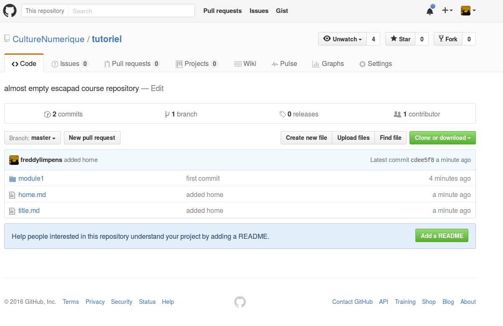
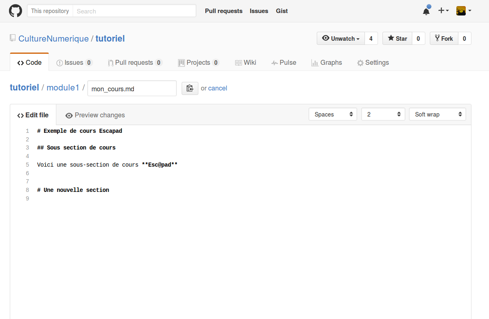
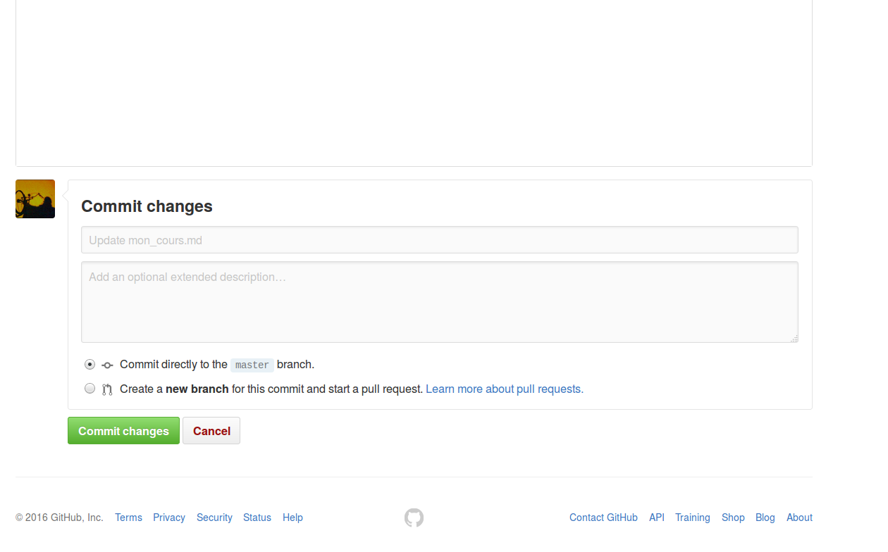
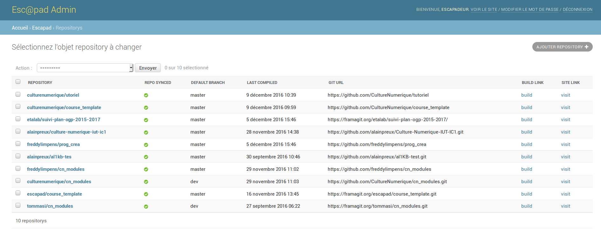
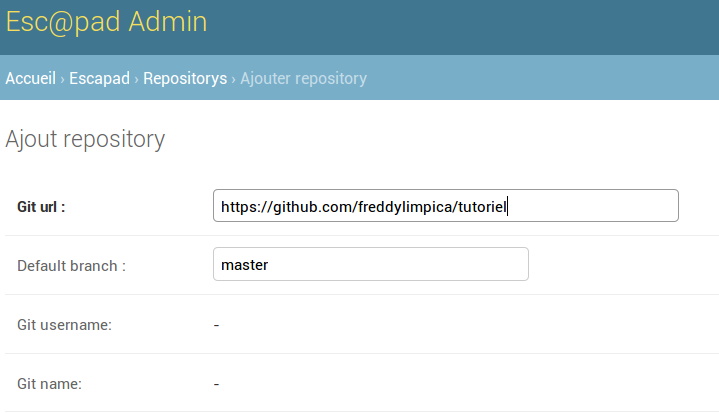
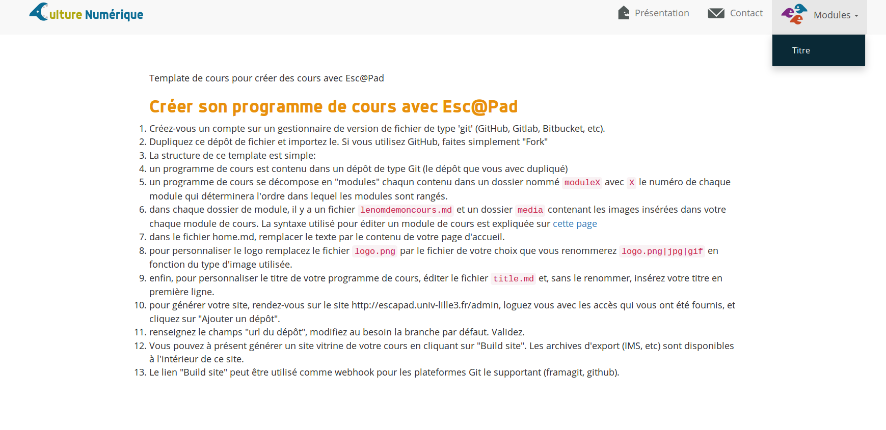

Tutoriel de prise en main de la chaine éditoriale Esc@pad
=========================================================

Ce chapitre propose un parcours type permettant de prendre en main les outils et technologies qui composent la chaine éditoriale Esc@Pad. L'objectif à l'issue de ce tutoriel est d'être capable d'éditer un contenu pédagogique en autonomie en utilisant Esc@pad. Les outils et notions abordées sont:
- les rudiments de `git` et de la plateforme GitHub (création d'un compte, fork, commits)
- la syntaxe markdown pour la rédaction du contenu
- la syntaxe GIFT pour la création de quiz
- l'usage de l'application Escapad pour la génération des supports multi-format (web, IMS/Moodle, EDX)


## Création d'un compte GitHub et fork

### Création du compte

- remplissez et validez le formulaire localisé à [https://github.com/join](https://github.com/join)
- à l'étape suivante "Choose your plan", laissez l'option "Unlimited public repositories for free", cliquez sur "Continue"
- l'étape suivante "Tailor your experience" peut être sautée ("Skip this step")
- à l'écran final "Learn Git and GitHub without any code!" qui vous invite à lire le guide (hautement conseillé pour la suite néanmoins), ne faites rien, et passez à la suite de ce tutoriel.

### "Fork" du dépôt-exemple

- loguez-vous sur github.com avec votre nouveau `monlogingithub` (login d'exemple utilisé pour la suite, NDR.) et allez sur [https://github.com/CultureNumerique/tutoriel](https://github.com/CultureNumerique/tutoriel)
- cliquez sur le bouton "Fork" en haut à droite
- vous arrivez normalement sur la page du dépôt "forké" `https://github.com/monlogingithub/tutoriel`


Notez à ce stade l'arborescence type d'un dépôt de cours qui contient 1 module "module1" (explorez les dossiers en cliquant sur leur nom):

```
- module1/
    - mon_cours.md
    - media/
        - vue_web_cours.png
- home.md
- title.md    
```

## Rédaction Markdown et premier commit

- allez sur la page du fichier `module1/mon_cours.md`. Cette page montre la version "aperçu" du code source markdown du module 1.
- Pour voir et modifier le  code markdown cliquez sur "🖉 Edit this file". Vous pouvez à partir de cet écran éditer le source dans la zone de texte qui propose une coloration syntaxique permettant de vous guider (cf ci-dessous).


## Syntaxe Markdown

La synaxe Markdown est [présentée sur cette page](https://github.com/adam-p/markdown-here/wiki/Markdown-Cheatsheet). La première chose est de repérer la structuration du document en section qui peut se faire à l'aide des niveaux d'en-têtes:

```
# section
## Sous-section
### sous-sous-section

etc..
```

À présent, et en vous aidant de cette syntaxe et du module 1 cours-modèle [example_module1](https://github.com/CultureNumerique/course_template/blob/master/module1/example_module1.md), modifier le texte et les titres de la première section et sous-section avec le texte de votre choix.

Quelques suggestions:
- Vous pouvez reprendre une sous-section de cours d'un des [modules CultureNumerique dont les sources sont également sur github](https://github.com/CultureNumerique/cn_modules). Par exemple la 1ère sous-section "Présentation du cours" du [module 4](https://github.com/CultureNumerique/cn_modules/edit/master/module4/traitementsDeTexteTableur.md)
- rédigez [2 paragraphes](https://github.com/adam-p/markdown-here/wiki/Markdown-Cheatsheet#line-breaks), dont l'un contient un [lien hypertexte](https://github.com/adam-p/markdown-here/wiki/Markdown-Cheatsheet#links), et l'autre [une liste à puce ou numérotée](https://github.com/adam-p/markdown-here/wiki/Markdown-Cheatsheet#lists)

### Premier commit

- Une fois que vous avez terminé d'éditer, descendez vers la zone située juste en dessous de la zone d'édition "Commit changes"

- Dans cette zone vous pouvez :
    - [optionnel] saisir un message court dans le premier champ texte ...
    - [optionnel]... compléter au besoin dans le 2e champ texte
    - [optionnel] modifier ou conserver le choix par défaut " Commit directly to the master branch"
    - [nécessaire] **enregistrer** vos changements **en cliquant sur le bouton "Commit changes"** (i.e "valider les changements" en français)

Et voilà ! Vous venez de soumettre votre premier **commit** sur la **branche master** de _votre_ **fork** du **dépôt git** ["tutoriel"](https://github.com/CultureNumerique/tutoriel) publié sur GitHub par le prolifique [compte de CultureNumerique](https://github.com/CultureNumerique) :)

**NB** Pour être sûr que l'affichage correspond à votre intention, vérifier le résultat sur le rendu de la page qui s'affiche après avoir commité.

### Enregistrement et génération du mini-site sur Escapad

- loguez-vous sur [l'interface d'admin d'Escapad](http://escapad.univ-lille3.fr/admin) en utilisant le login et mot de passe qui vous ont été donnés.
- En cliquant sur ["Repositorys"](http://escapad.univ-lille3.fr/admin/escapad/repository/), vous arrivez sur l'écran suivant:

- cliquez sur "Ajouter repository" en haut à droite
- le seul champ  à modifier est "Git url": vous y collez le lien de votre propre dépôt git qui doit être de la forme `https://github.com/votre_login_github/tutoriel`

- cliquez ensuite sur "enregistrer" en bas à droite
- vous devez alors revenir à l'écran listant les dépôts.
- Pour chaque dépôt, le lien "build" (colonne "BUILD LINK" à droite) permet de générer le site vitrine de votre dépôt. cliquez sur ce lien pour votre dépôt (reconnaissable grâce à l'adresse "GIT URL"); vous devez arriver sur l'écran ci-après qui correspond à la version mini-site web:

