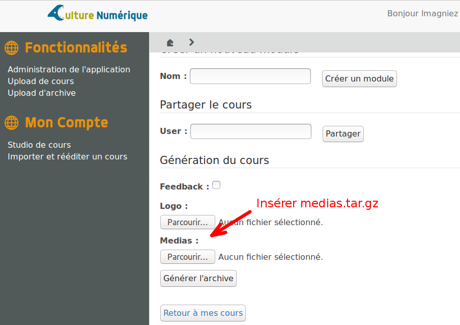
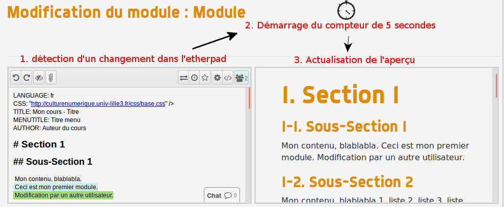

# Tutoriel de prise en main de l'éditeur collaboratif de cours Esc@pad
===========================================================

Dans ce chapitre, nous allons présenter les différentes fonctionnalités de l'éditeur collaboratif de cours.
Celui-ci se base sur le framework Django et l'éditeur de texte collaboratif Etherpad.


## Fonctionnalités
La seconde application repose en particulier sur son interface de gestion de cours.
Un utilisateur connecté peut :
- Créer/Gérer ses cours
- Créer/Modifier des modules
- Générer des cours
- Partager son cours avec un autre utilisateur.


Cette application nécessite une instance de l’éditeur collaboratif **etherpad**. Veuillez récupérer celle fourni par Culture Numérique, nous avons en effet effectué des modifications dans le code permettant des échanges avec l’application.

## Revue des différentes fonctionnalités
### Hors-ligne : Génération d’un cours via formulaire
L’utilisateur peut utiliser la librairie de parsing sans avoir à se connecter. 
Il doit pour ça inclure l’ensemble des fichiers markdown/GIFT et médias dans le formulaire.

### Hors-ligne : Génération d’un cours via archive
Une autre manière d’utiliser la librairie de parsing. Plus rapide, mais nécessite à l’utilisateur plus de travail de son côté. Il doit générer l’archive contenant le cours en suivant l’arborescence imposée. (Comme celle sur le dépôt git).

### Import de cours
Si jamais un utilisateur souhaite **réutiliser un cours précédemment généré** dans l’application, il peut à partir de cette page intégrer l’archive **export.tar.gz** contenu dans le dossier export de l’archive du site généré.
Cela aura pour effet de recréer sur l’application l’ensemble du contenu du cours sur des instances d’etherpad, dans un cours associé à l’utilisateur.

### Gestion d’un cours
A partir de cette page, l’utilisateur peut accéder à l’ensemble de ses modules pour modifier leurs contenus. Il dispose également d’autres fonctionnalités
Génération du cours et intégrer des images :
C’est aussi sur cette page que l’utilisateur génère son cours.
Pour intégrer des médias à celui-ci, il va falloir uploader une archive contenant l’ensemble des médias en suivant l’architecture suivante :
```
/media.tar.gz
    |_module1/
            image1
            image2
            ...
    |_module2/
            image3
            image4
             ...
    ...
```
Pour faire référence à une image dans le pad, il suffit d'indiquer le chemin comme ceci:
```

```
Lors de la génération, déposer l'archive à l'emplacement indiqué :




### Partage du cours
Si il le souhaite, l’utilisateur peut également **partager son cours avec un autre utilisateur**. Pour cela, il suffira d’**indiquer le nom de l’utilisateur** à inviter pour qu’il puisse également contribuer au cours.
L’utilisateur invité sera directement intégré au cours et sera considéré comme **propriétaire** également. 
**(Si le créateur du cours supprime le cours de son compte, celui-ci restera accessible pour l’invité !)**


## Fonctionnement de l’aperçu du cours
### Explications générale
L’application dispose d’une fonctionnalité permettant de fournir un aperçu dynamique du cours lors de l’édition. 
Lorsque la page détecte un changement dans l’instance etherpad, **un tampon de 5 secondes** se met en place et au bout de celui-ci, l’application actualise l’aperçu.



### Processus d’actualisation
Avant toute chose, il convient de détailler la structure de la page d’édition.
Celle-ci est une page contenant deux iframe, qui sont par définition des fenêtres filles dépendantes de la fenêtre principale :
- **iframe 1 :** Instance d’etherpad, L’utilisateur écrit son cours (en collaboration si il le souhaite).
- **iframe 2 :** Page d’aperçu, à partir d’un code Markdown+Gift, génère un aperçu HTML du résultat (on passe par le parsing HTML d’une page).

Pour effectuer l’actualisation, on a du modifier le code source d’etherpad, afin que celui-ci envoie des notifications à la page associée.
La page parent (page d’édition) dispose d’**un écouteur** qui se charge de détecter les événements de l’iframe 1. Lorsqu’il reçoit l’événement, il lance le compteur de 5 secondes et va actualiser l’iframe 2 au bout de ce laps de temps.
Tout cela s’effectue en javascript à l’aide d’appels ajax.
